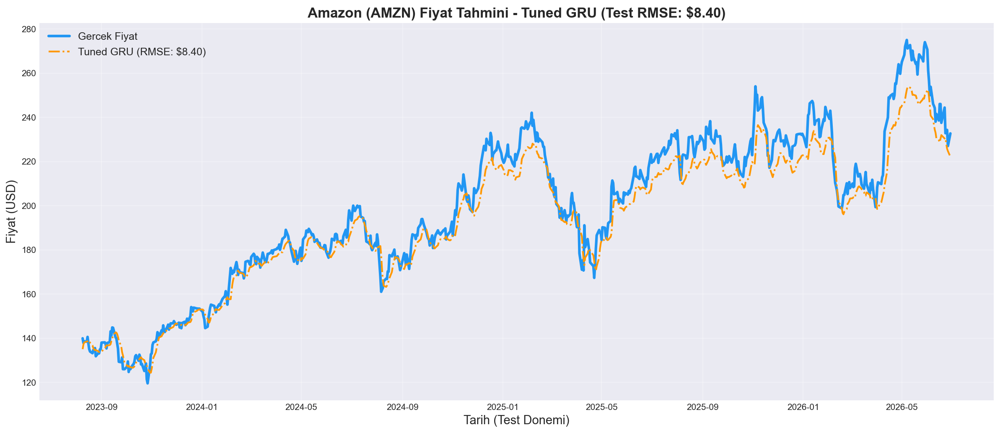
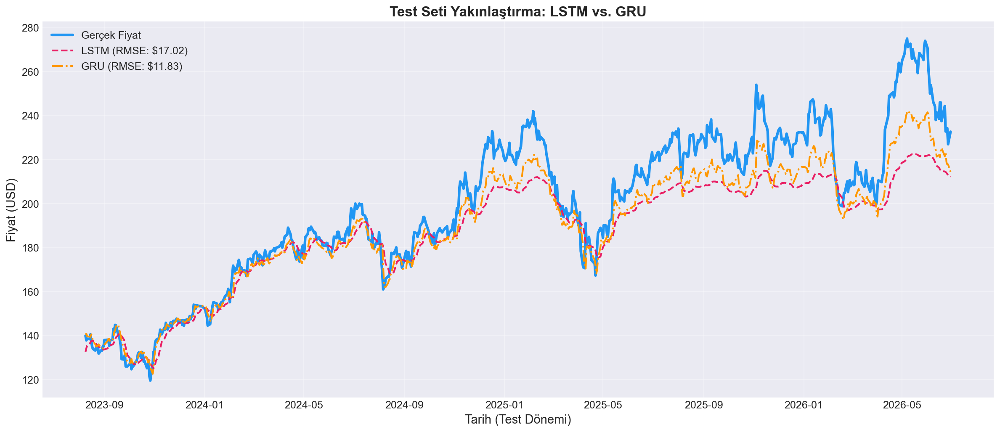
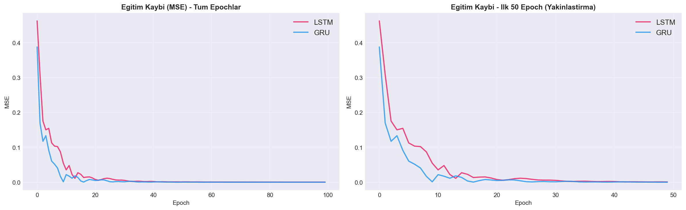

# Stock Price Prediction with PyTorch - LSTM & GRU

Amazon (AMZN) hisse senedi fiyat tahmini projesi. PyTorch kullanılarak LSTM ve GRU modelleri ile zaman serisi regresyonu yapılmıştır.

## Proje Hakkında

Bu proje, derin öğrenme tabanlı zaman serisi analizi kullanarak Amazon hisse senedinin kapanış fiyatını tahmin etmeyi amaçlamaktadır.

**Temel Özellikler:**
- `yfinance` ile Yahoo Finance'den gerçek zamanlı veri indirme
- MinMaxScaler ile normalizasyon ve sliding window ile sekans oluşturma
- LSTM ve GRU modellerinin PyTorch ile oluşturulması, eğitilmesi ve karşılaştırılması
- Hiperparametre optimizasyonu (Dropout, epoch sayısı, katman boyutu)
- MSE ve RMSE metrikleri ile model değerlendirmesi

**Referans:** [Stock Price Prediction with PyTorch - Rodolfo Saldanha (Medium)](https://medium.com/swlh/stock-price-prediction-with-pytorch-37f52ae84632)

## Proje Yapısı

```
├── README.md               # Bu dosya
├── requirements.txt         # Python bağımlılıkları
├── .gitignore              # Git tarafından yok sayılacak dosyalar
│
├── notebooks/
│   ├── dataset_eda.ipynb    # Veri indirme ve keşifçi veri analizi (EDA)
│   ├── preprocessing.ipynb  # Normalizasyon, sliding window, train/test split
│   ├── training.ipynb       # LSTM ve GRU model tanımları ve eğitimi
│   ├── evaluation.ipynb     # Model değerlendirme, RMSE, tahmin grafikleri
│   └── tuning.ipynb         # Hiperparametre optimizasyonu ve overfitting analizi
│
├── src/
│   └── models.py            # LSTM, GRU, TunedLSTM, TunedGRU sınıfları (script versiyonu)
│
├── data/
│   ├── AMZN.csv             # Ham veri (yfinance ile indirilmiş)
│   ├── tensors.pt           # İşlenmiş eğitim/test tensörleri
│   ├── scaler.pkl           # Fitted MinMaxScaler objesi
│   ├── metadata.pkl         # Lookback, tarih aralığı vb. bilgiler
│   ├── model_lstm.pt        # Eğitilmiş LSTM ağırlıkları
│   ├── model_gru.pt         # Eğitilmiş GRU ağırlıkları
│   ├── model_gru_tuned.pt   # Tuning sonrası GRU ağırlıkları
│   └── training_history.pkl # Eğitim loss geçmişi ve süreler
│
└── results/                 # Oluşturulan grafikler (.png)
```

## Kurulum ve Çalıştırma

### Gereksinimler

- Python 3.10+
- pip

### Adım 1: Repoyu Klonla

```bash
git clone https://github.com/EGuseinov/stock-price-prediction.git
cd stock-price-prediction
```

### Adım 2: Bağımlılıkları Kur

```bash
pip install -r requirements.txt
```

### Adım 3: Notebook'ları Sırasıyla Çalıştır

```bash
cd notebooks
jupyter notebook
```

Notebook'ları şu sırayla çalıştırın:

| # | Notebook | Açıklama |
|---|----------|----------|
| 1 | `dataset_eda.ipynb` | Veri indirme ve keşifçi analiz |
| 2 | `preprocessing.ipynb` | Normalizasyon ve veri hazırlığı |
| 3 | `training.ipynb` | LSTM ve GRU eğitimi |
| 4 | `evaluation.ipynb` | Model değerlendirme ve karşılaştırma |
| 5 | `tuning.ipynb` | Hiperparametre optimizasyonu |

> **Not:** GPU gerekmez. Tüm eğitimler CPU üzerinde birkaç saniye içinde tamamlanır.

## Veri Seti

| Bilgi | Değer |
|-------|-------|
| **Kaynak** | Yahoo Finance (`yfinance`) |
| **Hisse** | Amazon (AMZN) |
| **Tarih Aralığı** | 2012-01-03 - 2026-06-29 |
| **Toplam Satır** | 3,642 |
| **Kullanılan Özellik** | Kapanış fiyatı (Close) |
| **Eksik Veri** | 0 |

## Yöntem

### Veri Ön İşleme
- **Normalizasyon:** `MinMaxScaler(feature_range=(-1, 1))` ile tüm fiyatlar [-1, 1] aralığına ölçeklendi
- **Sliding Window:** `lookback=20` (yaklaşık 1 aylık iş günü) ile sekanslar oluşturuldu
- **Train/Test Split:** %80 eğitim (2012-2023) / %20 test (2023-2026), kronolojik

### Model Mimarisi

Her iki model de `nn.Module` üzerinden türetildi:

| Parametre | Değer |
|-----------|-------|
| `input_dim` | 1 |
| `hidden_dim` | 32 |
| `num_layers` | 2 |
| `output_dim` | 1 |
| `batch_first` | True |

- **Optimizer:** Adam (`lr=0.01`)
- **Kayıp Fonksiyonu:** MSELoss

### LSTM vs GRU Farkı

| Özellik | LSTM | GRU |
|---------|------|-----|
| Kapı sayısı | 3 (forget, input, output) | 2 (reset, update) |
| Cell state | Var | Yok |
| Parametre sayısı | Daha fazla | Daha az |
| Eğitim hızı | Daha yavaş | Daha hızlı |

## Sonuçlar

### Temel Model Karşılaştırması (100 Epoch)

| Model | Train RMSE | Test RMSE | Eğitim Süresi |
|-------|-----------|-----------|---------------|
| LSTM | ~$3.27 | ~$17.02 | ~8s |
| GRU | ~$2.21 | **~$11.83** | ~12s |

### Hiperparametre Optimizasyonu Sonrası

Tuning notebook'unda Dropout (0.1) ve erken durdurma (80 epoch) uygulanarak GRU daha da iyileştirildi:

| Model | Test RMSE |
|-------|-----------|
| GRU (Baseline) | $11.83 |
| **GRU (Tuned)** | **$8.40** |

> **Sonuç:** GRU modeli hem hız hem doğruluk açısından LSTM'den üstün çıkmıştır.
> Tuning ile test hatası **%29 oranında azaltılmıştır** ($11.83 -> $8.40).

### Örnek Tahmin Grafikleri

#### Gerçek vs Tahmin - GRU (Tuned)


#### LSTM vs GRU Karşılaştırma - Test Seti Yakınlaştırma


#### Eğitim Kaybı (Training Loss)


## Önemli Notlar ve Eleştirel Değerlendirme

- Bu proje **eğitim amaçlıdır** ve gerçek yatırım tavsiyesi değildir.
- Zaman serisi modelleri genellikle fiyatın bir gün önceki halini "kopyalamaya" meyillidir.
- Sadece geçmiş fiyatlara bakarak (univariate) hisse fiyatını kesin olarak tahmin etmek mümkün değildir. Gerçek dünyada haberler, bilançolar, makroekonomik veriler gibi birçok faktör fiyatı etkiler.
- Daha ileri çalışmalar: çoklu özellik (multivariate), Transformer tabanlı modeller, Attention mekanizması.

## Teknolojiler

- Python 3.12
- PyTorch 2.12
- pandas, numpy, matplotlib
- scikit-learn (MinMaxScaler)
- yfinance
- Jupyter Notebook
